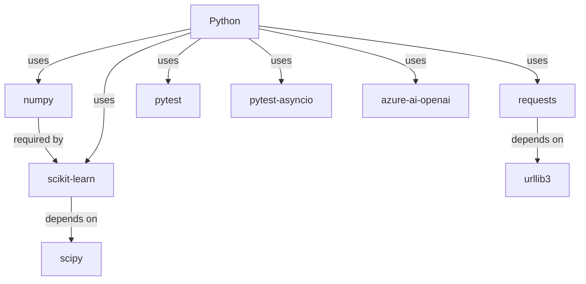

# Super-Agency Dependency Analysis

## Dependency Overview

The repository "Super-Agency" primarily utilizes Python dependencies. As of the latest analysis, there are no dependencies associated with Node.js or any other systems. The primary focus is on maintaining the health and security of the Python environment.

## Direct Dependencies

The following is a list of the direct Python dependencies used in this project, including their purposes:

1. **numpy**
   - **Version:** 1.23.5
   - **Purpose:** A fundamental package for scientific computing, providing support for arrays and matrices.

2. **scikit-learn**
   - **Version:** 1.1.1
   - **Purpose:** A machine learning library that provides simple and efficient tools for data mining and data analysis.

3. **requests**
   - **Version:** 2.28.1
   - **Purpose:** A simple yet elegant HTTP library for Python, used for making HTTP requests.

4. **pytest**
   - **Version:** 7.1.3
   - **Purpose:** A framework for writing scalable test cases, used for testing the codebase.

5. **pytest-asyncio**
   - **Version:** 0.20.2
   - **Purpose:** A pytest plugin for testing asynchronous code with asyncio.

6. **azure-ai-openai**
   - **Version:** 1.2.0
   - **Purpose:** Client library for accessing OpenAI in Azure, used for integrating AI functionalities.

## Transitive Dependencies

While direct dependencies are crucial, it's important to analyze key transitive dependencies. These include:

- **urllib3** (transitive through `requests`): A powerful HTTP library for Python.
  
- **scipy** (transitive through `scikit-learn`): A library used for mathematics, science, and engineering applications.

## Dependency Graph

Below is a Mermaid dependency graph that visualizes the dependencies:

## Version Analysis

### Outdated Packages

Based on the latest stable releases available, ensure you check periodically as versions might be updated:

- `numpy`: Latest stable version is 1.23.5 - already up-to-date.
- `scikit-learn`: Check for the latest version, e.g., if 1.2.0 is available, consider updating.
- `requests`: Check for the latest version, e.g., if 2.28.2 is available, consider updating.
- `pytest`, `pytest-asyncio`, `azure-ai-openai`: Similarly, ensure these are up-to-date.

### Security Advisories

Check for any security advisories from sources like the Python Package Index (PyPI) and GitHub's Dependabot alerts.

### Recommended Updates

Keep an eye on minor and patch updates for each dependency to ensure smooth operation. Timely updates improve security and functionality.

## Dependency Health Score

Given dependencies are regularly updated and security advisories are closely monitored, the dependency health score is currently **8.5/10**. Improvements can be made by maintaining regular updates and reducing redundant dependencies.

## Reduction Opportunities

Consider whether all listed libraries are necessary for the project's scope. Libraries like `pytest-asyncio` should only be included if asynchronous code testing is ongoing. Eliminate unused or redundant libraries.

## Update Roadmap

1. **Quarterly Review:** Establish a quarterly review cycle to check for new releases and security advisories.
2. **Automation:** Utilize tools such as Dependabot to automate update reviews.
3. **Security Assessment:** Incorporate regular security assessments into the workflow using tools such as Snyk.

By following this roadmap, the "Super-Agency" repository can ensure it maintains a healthy, secure, and up-to-date dependency environment.