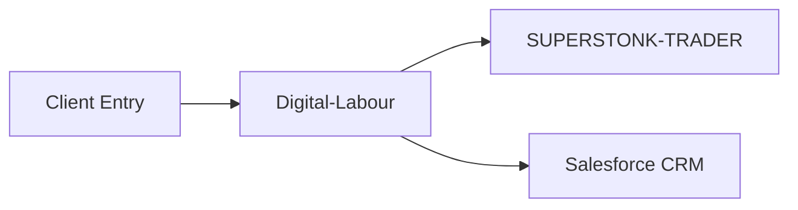
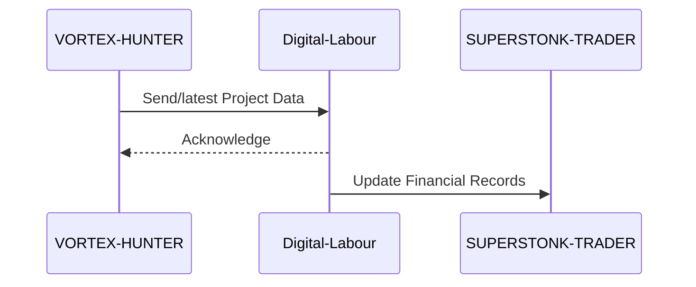

# INTEGRATION_DESIGN.md

## 1. Integration Overview

The "Digital-Labour" repository is a central component of our digital portfolio, designed to serve as the core agency management system. It currently holds functionalities critical to managing agency operations, client relationships, and project tracking. The purpose of this document is to ensure smooth integration with other components of our technology stack and to outline strategies for effective communication with both internal and external services.

## 2. Current Integration Points

Digital-Labour currently integrates with:
- **VORTEX-HUNTER** for data synchronization.
- **demo** for testing and prototyping.
- **YOUTUBEDROP** for multimedia resource sharing.
- Various internal helper services to perform specific agency functions.

## 3. Proposed Integrations

### 3.1 With Other Portfolio Repos

- **SUPERSTONK-TRADER**: Facilitate financial data exchange to streamline accounting and asset management.
- **HUMAN-HEALTH**: Integrate wellness tracking capabilities to enhance employee management features.

### 3.2 External Service Integrations

- **Salesforce CRM**: Enhance client relationship management capability by integrating external CRM functionalities.
- **Google Analytics**: Provide in-depth analytics on agency operations and client interactions.
- **Stripe Payment Gateway**: Enable secure and efficient payment solutions for agency invoicing.

## 4. API Design

Integration with the Digital-Labour system will utilize RESTful APIs. Key API endpoints will include:

- `/clients`: Manage client data.
- `/projects`: Access and update project details.
- `/financials`: Retrieve and update financial records.
  
Each endpoint will support standard HTTP methods (GET, POST, PUT, DELETE), and JSON will be used for data serialization.

## 5. Data Flow Diagrams

### 5.1 Client Data Flow

## 6. Authentication & Authorization

Authentication will be achieved through OAuth 2.0, providing secure and scalable means to grant access tokens for authorized API usage. Role-based access control (RBAC) will be enforced, ensuring users only access resources pertinent to their permission levels.

## 7. Error Handling Strategy

- **Client-side errors (4xx)**: Return informative error messages detailing the cause of the error.
- **Server-side errors (5xx)**: Log detailed messages for backend reviews; return generic messages to clients to prevent information leakage.
- Implement retries for transient failures to improve reliability.

## 8. Implementation Phases

1. **Design & Planning**: Draft detailed integration plans and internal reviews.
2. **Development**: Implement integration points and APIs.
3. **Testing**: Conduct exhaustive testing.
4. **Deployment**: Roll-out integrations in phases with user feedback.
5. **Monitoring & Iteration**: Continuously monitor performance and iterate based on feedback.

## 9. Testing Strategy for Integrations

- **Unit Testing**: Validate individual components within integration points.
- **Integration Testing**: Ensure cohesive operation between systems and verify all integration points.
- **Performance Testing**: Test the scalability and robustness of integrations.
- **User Acceptance Testing (UAT)**: Gather and incorporate end-user feedback before final deployment.

### 9.1 Key Flow Sequence Diagrams

#### 9.1.1 Project Data Synchronization

This document outlines the strategic integration plan intended to boost Digital-Labour's functionality and interconnectivity within our existing technological portfolio and various external services.